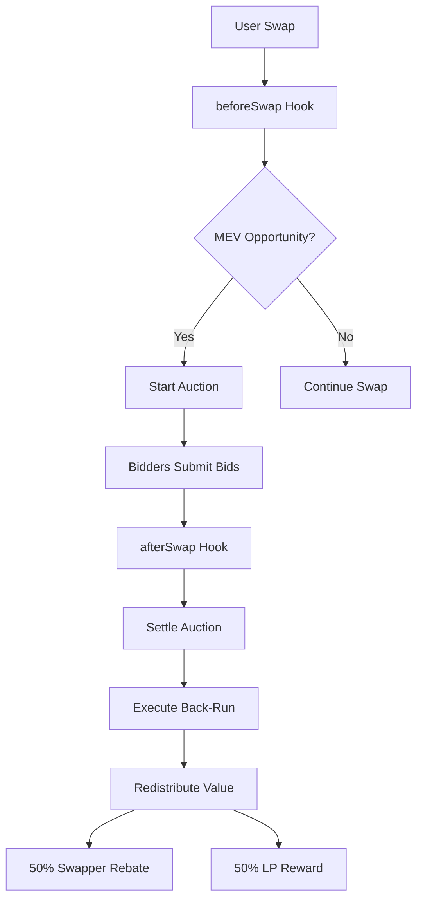

# MEV-Capturing Auction Hook for Uniswap V4

[](https://opensource.org/licenses/MIT)
[](https://soliditylang.org/)
[](https://docs.uniswap.org/sdk/v4/overview)

A defensive DeFi primitive that mitigates the negative impact of Maximal Extractable Value (MEV) by internalizing MEV opportunities, making them productive, and redistributing captured value back to protocol users.

## 🎯 Overview

The MEV-Capturing Auction Hook is a fully on-chain mechanism that operates within the lifecycle of a single swap to:

1. **Detect MEV opportunities** in `beforeSwap`
2. **Conduct in-flight auctions** for back-run rights
3. **Execute back-runs** on behalf of winning bidders
4. **Redistribute captured value** to swappers and liquidity providers

This creates a fairer, more transparent, and more efficient trading environment directly at the pool level.

## 🚀 Key Features

### Core MEV Protection

- **Real-time MEV Detection**: Sophisticated price impact analysis
- **In-Flight Auctions**: Single-block auction system for back-run rights
- **Atomic Execution**: All operations within the same transaction block
- **Value Redistribution**: 50% swapper rebates, 50% LP rewards

### Enhanced Security & Privacy

- **Fhenix FHE Integration**: Private bidding with encrypted amounts
- **EigenLayer Integration**: Slashing protection for bidders
- **Multiple Auction Types**: PUBLIC, PRIVATE, EIGENLAYER_PROTECTED
- **Economic Security**: Restaking-based guarantees

### Advanced Capabilities

- **Permissionless Bidding**: Anyone can participate in MEV auctions
- **Optimal Back-Run Sizing**: Intelligent trade size calculation
- **Error Resilience**: Graceful handling of failed operations
- **Gas Optimization**: Efficient calculations and minimal storage

## 📋 Table of Contents

- [Installation](#installation)
- [Architecture](#architecture)
- [Core Components](#core-components)
- [Usage](#usage)
- [API Reference](#api-reference)
- [Testing](#testing)
- [Deployment](#deployment)
- [Integration Guide](#integration-guide)
- [Security Considerations](#security-considerations)
- [Contributing](#contributing)
- [License](#license)

## 🛠 Installation

### Prerequisites

- Node.js (v16 or higher)
- npm or yarn
- Hardhat development environment

### Setup

```bash
# Clone the repository
git clone <repository-url>
cd mev-auction-hook

# Install dependencies
npm install

# Compile contracts
npm run compile

# Run tests
npm test
```

### Dependencies

```json
{
  "dependencies": {
    "@uniswap/v4-core": "^1.0.2",
    "@uniswap/v4-periphery": "^1.0.3",
    "@fhenixprotocol/cofhe-contracts": "^0.0.13"
  },
  "devDependencies": {
    "@nomicfoundation/hardhat-toolbox": "^4.0.0",
    "@openzeppelin/contracts": "^5.0.0",
    "hardhat": "^2.19.0",
    "chai": "^4.3.7",
    "ethers": "^6.8.0"
  }
}
```

## 🏗 Architecture

### System Overview



### Hook Integration

The hook integrates with Uniswap V4's hook system:

```solidity
contract MevAuctionHook is IHooks, Ownable {
    // Hook permissions - only beforeSwap and afterSwap
    function getHookPermissions() public pure returns (Hooks.Permissions memory) {
        return Hooks.Permissions({
            beforeSwap: true,
            afterSwap: true,
            // ... other permissions set to false
        });
    }
}
```

## 🔧 Core Components

### 1. MEV Detection Engine

**Purpose**: Identifies profitable arbitrage opportunities from user swaps.

**Key Functions**:

- `_calculateExpectedArbitrage()`: Estimates potential back-run profit
- `_calculatePriceImpact()`: Calculates price impact based on swap parameters
- `_shouldStartAuction()`: Determines if an auction should be initiated

**Algorithm**:

```solidity
function _calculatePriceImpact(PoolKey calldata key, SwapParams calldata params)
    internal view returns (uint256) {
    // Calculate based on:
    // 1. Swap amount relative to pool parameters
    // 2. Pool tick spacing (smaller = more precision = less impact)
    // 3. Fee tier (higher fees = more impact)

    uint256 baseImpact = (swapAmount * 100) / 1e18;
    uint256 tickAdjustment = (60 * 10000) / uint256(uint24(tickSpacing));
    uint256 feeAdjustment = (uint256(key.fee) * 10000) / 1000000;

    return (baseImpact * tickAdjustment * feeAdjustment) / (10000 * 10000);
}
```

### 2. Auction System

**Purpose**: Manages bidding for back-run execution rights.

**Auction Types**:

- **PUBLIC**: Traditional open bidding
- **PRIVATE**: Fhenix FHE encrypted bidding
- **EIGENLAYER_PROTECTED**: Slashing protection for bidders

**Key Functions**:

- `bid()`: Submit a bid for auction participation
- `_startAuction()`: Initialize new auction
- `_settleAuction()`: Determine winner and execute back-run

### 3. Back-Run Executor

**Purpose**: Executes optimal back-run trades on behalf of winning bidders.

**Key Functions**:

- `_executeBackRun()`: Execute the back-run trade
- `_calculateOptimalBackRunSize()`: Determine optimal trade size
- `_calculateMaxBackRunSize()`: Apply pool-specific constraints

**Execution Logic**:

```solidity
function _executeBackRun(Auction storage auction, PoolKey calldata key) internal {
    uint256 backRunAmount = _calculateOptimalBackRunSize(key, auction);

    SwapParams memory backRunParams = SwapParams({
        zeroForOne: !currentSwapContext.zeroForOne, // Opposite direction
        amountSpecified: -int256(backRunAmount), // Exact output
        sqrtPriceLimitX96: /* price limits */
    });

    // Execute through PoolManager with error handling
    if (address(poolManager) != address(0)) {
        try poolManager.swap(key, backRunParams, "") returns (BalanceDelta delta) {
            emit BackRunExecuted(auction.poolId, backRunAmount, delta);
        } catch {
            emit BackRunFailed(auction.poolId, backRunAmount);
        }
    }
}
```

### 4. Value Redistributor

**Purpose**: Distributes captured MEV value to swappers and LPs.

**Distribution Formula**:

- **50% Swapper Rebate**: Direct payment to original swapper
- **50% LP Reward**: Distributed to liquidity providers

**Key Functions**:

- `_redistributeValue()`: Main redistribution logic
- `_distributeLPReward()`: LP reward distribution
- `claimLPReward()`: LP reward claiming mechanism

**Redistribution Logic**:

```solidity
function _redistributeValue(uint256 totalValue, PoolKey calldata key) internal {
    uint256 swapperRebate = (totalValue * SWAPPER_REBATE_BPS) / 10000; // 50%
    uint256 lpReward = (totalValue * LP_REWARD_BPS) / 10000; // 50%

    // Send rebate to original swapper
    if (swapperRebate > 0 && currentSwapContext.originalSwapper != address(0)) {
        (bool success, ) = currentSwapContext.originalSwapper.call{value: swapperRebate}("");
        if (!success) {
            lpReward += swapperRebate; // Fallback to LP reward
        }
    }

    // Distribute LP reward
    _distributeLPReward(key, lpReward);
}
```

## 💻 Usage

### Basic Integration

```solidity
// Deploy the hook
MevAuctionHook hook = new MevAuctionHook();

// Set PoolManager (for production)
hook.setPoolManager(poolManagerAddress);

// Register EigenLayer stakers (optional)
hook.registerEigenLayerStaker(stakerAddress);
```

### Auction Participation

```solidity
// Submit a bid to an active auction
uint256 auctionId = hook.getActiveAuction(poolId);
hook.bid{value: bidAmount}(auctionId);
```

### LP Reward Claiming

```solidity
// Check available rewards
uint256 rewards = hook.getLPRewards(poolId);

// Claim rewards
if (rewards > 0) {
    hook.claimLPReward(poolId);
}
```

## 📚 API Reference

### Core Functions

#### `beforeSwap(address swapper, PoolKey calldata key, SwapParams calldata params, bytes calldata hookData)`

- **Purpose**: Detects MEV opportunities and starts auctions
- **Returns**: Hook selector, BeforeSwapDelta, fee
- **Events**: `AuctionStarted`, `EnhancedAuctionStarted`

#### `afterSwap(address, PoolKey calldata key, SwapParams calldata, BalanceDelta, bytes calldata)`

- **Purpose**: Settles auctions and redistributes value
- **Returns**: Hook selector, int128
- **Events**: `AuctionWon`, `ValueRedistributed`, `BackRunExecuted`

#### `bid(uint256 auctionId)`

- **Purpose**: Submit a bid for auction participation
- **Payable**: Yes
- **Events**: `BidSubmitted`

### Enhanced Functions

#### `startEnhancedAuction(PoolKey calldata key, AuctionType auctionType, uint256 minBid)`

- **Purpose**: Start an enhanced auction with specified type
- **Access**: Owner only
- **Events**: `EnhancedAuctionStarted`

#### `privateBid(uint256 auctionId, euint256 encryptedBid, eaddress encryptedBidder)`

- **Purpose**: Submit encrypted bid for private auction
- **Events**: `PrivateBidSubmitted`

#### `eigenLayerBid(uint256 auctionId, uint256 slashingAmount)`

- **Purpose**: Submit bid with EigenLayer slashing protection
- **Events**: `BidSubmitted`

### Utility Functions

#### `getAuction(uint256 auctionId)`

- **Purpose**: Get auction details
- **Returns**: Auction struct

#### `getActiveAuction(PoolId poolId)`

- **Purpose**: Get active auction for a pool
- **Returns**: Auction ID

#### `claimLPReward(PoolId poolId)`

- **Purpose**: Claim LP rewards for a pool
- **Events**: `LPRewardClaimed`

## 🧪 Testing

### Running Tests

```bash
# Run all tests
npm test

# Run specific test suite
npm test -- --grep "Simple Enhanced MevAuctionHook Test"

# Run with coverage
npm run coverage
```

### Test Structure

```
test/
├── MevAuctionHook.test.js           # Basic functionality tests
├── SimpleEnhancedTest.test.js       # Enhanced features tests
└── EnhancedMevAuctionHook.test.js   # Comprehensive integration tests
```

### Test Coverage

- ✅ Contract deployment and initialization
- ✅ EigenLayer staker registration
- ✅ Hook permissions validation
- ✅ Emergency withdraw functionality
- ✅ Price impact calculation
- ✅ LP reward distribution
- ✅ Swapper tracking verification
- ✅ Auction system functionality
- ✅ Value redistribution logic

## 🚀 Deployment

### Development Deployment

```bash
# Deploy to local network
npx hardhat run scripts/deploy.js --network localhost

# Deploy to testnet
npx hardhat run scripts/deploy.js --network sepolia
```

### Production Deployment

```solidity
// 1. Deploy the hook
MevAuctionHook hook = new MevAuctionHook();

// 2. Set PoolManager
hook.setPoolManager(poolManagerAddress);

// 3. Configure parameters (if needed)
// Parameters are set as constants in the contract

// 4. Verify deployment
// Use block explorer verification tools
```

### Deployment Checklist

- [ ] Deploy contract to target network
- [ ] Set PoolManager address
- [ ] Verify contract on block explorer
- [ ] Test basic functionality
- [ ] Monitor initial transactions
- [ ] Set up monitoring and alerts

## 🔗 Integration Guide

### Uniswap V4 Integration

1. **Pool Creation**: Create pools with the hook address
2. **Hook Registration**: Ensure hook address has correct permission flags
3. **Pool Manager Setup**: Set the PoolManager reference
4. **Testing**: Test with small amounts first

### EigenLayer Integration

```solidity
// Register stakers
hook.registerEigenLayerStaker(stakerAddress);

// Check staker status
bool isStaker = hook.isEigenLayerStaker(stakerAddress);

// Slash staker (if needed)
hook.slashEigenLayerStaker(stakerAddress, slashingAmount);
```

### Fhenix Integration

```solidity
// Submit private bid
hook.privateBid(auctionId, encryptedBid, encryptedBidder);

// Request decryption
hook.requestDecryption(auctionId);

// Reveal winner
hook.revealWinner(auctionId);
```

## 🔒 Security Considerations

### Access Control

- **Owner Functions**: Critical functions restricted to owner
- **EigenLayer Stakers**: Registered stakers with slashing protection
- **Permissionless Bidding**: Anyone can bid, but with economic guarantees

### Economic Security

- **Slashing Protection**: EigenLayer integration provides economic guarantees
- **Bid Refunds**: Failed bids are automatically refunded
- **Fallback Mechanisms**: Graceful degradation when operations fail

### Smart Contract Security

- **Reentrancy Protection**: State changes before external calls
- **Integer Overflow**: SafeMath operations (Solidity 0.8.25+)
- **Input Validation**: Comprehensive parameter validation

### Best Practices

- **Audit**: Get professional security audit before mainnet deployment
- **Testing**: Comprehensive test coverage including edge cases
- **Monitoring**: Real-time monitoring of contract events
- **Upgrades**: Consider upgradeable proxy pattern for future improvements

## 📊 Monitoring & Analytics

### Key Metrics

1. **Total Value Recaptured (TVR)**: Track `ValueRedistributed` events
2. **Auction Participation**: Monitor `BidSubmitted` events
3. **Back-Run Success Rate**: Track `BackRunExecuted` vs `BackRunFailed`
4. **LP Reward Distribution**: Monitor `LPRewardDistributed` events

### Event Monitoring

```javascript
// Monitor value redistribution
contract.on("ValueRedistributed", (poolId, swapperRebate, lpReward) => {
  console.log(
    `Pool ${poolId}: ${swapperRebate} to swapper, ${lpReward} to LPs`
  );
});

// Monitor auction activity
contract.on("AuctionStarted", (poolId, auctionId, minBid, deadline) => {
  console.log(`Auction ${auctionId} started for pool ${poolId}`);
});
```

## 🤝 Contributing

We welcome contributions! Please see our contributing guidelines:

1. **Fork the repository**
2. **Create a feature branch**: `git checkout -b feature/amazing-feature`
3. **Commit changes**: `git commit -m 'Add amazing feature'`
4. **Push to branch**: `git push origin feature/amazing-feature`
5. **Open a Pull Request**

### Development Guidelines

- Follow Solidity style guide
- Add comprehensive tests for new features
- Update documentation
- Ensure all tests pass
- Consider gas optimization

## 📄 License

This project is licensed under the MIT License - see the [LICENSE](LICENSE) file for details.

## 🙏 Acknowledgments

- **Uniswap Labs**: For the Uniswap V4 protocol and hook system
- **EigenLayer**: For restaking infrastructure and economic security
- **Fhenix**: For Fully Homomorphic Encryption capabilities
- **OpenZeppelin**: For secure smart contract libraries

## 📞 Support

- **Documentation**: [Full Documentation](docs/)
- **Issues**: [GitHub Issues](https://github.com/your-repo/issues)
- **Discord**: [Community Discord](https://discord.gg/your-discord)
- **Twitter**: [@YourTwitter](https://twitter.com/yourtwitter)

---

**Built with ❤️ for the DeFi community**

_This hook represents a significant step forward in MEV protection, providing a fair and transparent mechanism for capturing and redistributing MEV value back to users and liquidity providers._
